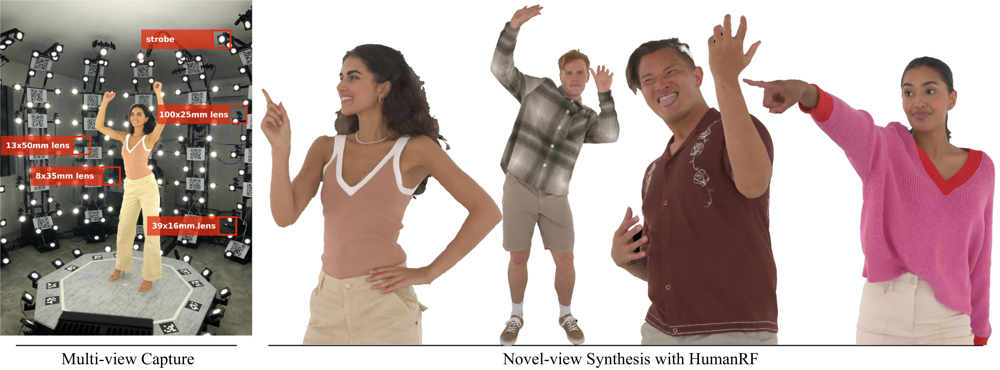
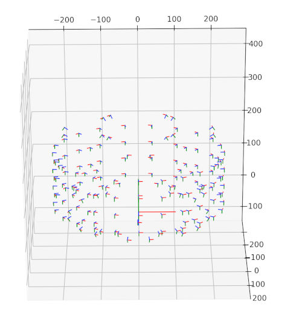

# Official repository of HumanRF and ActorsHQ



**HumanRF: High-Fidelity Neural Radiance Fields for Humans in Motion**<br>
Mustafa Işık, Martin Rünz, Markos Georgopoulos, Taras Khakhulin, Jonathan Starck, Lourdes Agapito, Matthias Nießner

## Installation

```bash

git clone --depth=1 --recursive https://github.com/synthesiaresearch/humanrf

pip install -r requirements.txt
pip install git+https://github.com/NVlabs/tiny-cuda-nn/#subdirectory=bindings/torch

# Install ActorsHQ package (dataset and data loader)
cd actorshq
pip3 install .

# Install HumanRF package (method)
cd ../humanrf
pip3 install .
```

## Usage

To get started quickly you can download a part of ActorsHQ and run HumanRF with the following commands:

```bash
./actorshq/dataset/download_manager.py \
    actorshq_access_4x.yaml \
    /tmp/actorshq \
    --actor Actor01 \
    --sequence Sequence1 \
    --scale 4 \
    --frame_start 15 \
    --frame_stop 65

./humanrf/run.py \
    --config example_humanrf \
    --workspace /tmp/example_workspace \
    --dataset.path /tmp/actorshq
```

For that you will need an access file `actorshq_access_4x.yaml`, which you can request [here](https://www.actors-hq.com/), see section "Data access and download" for more details.

## Data overview

The following datastructure is used to store the data:

```
└── Actor01
    └── Sequence1
        ├── 1x
        │   ├── calibration.csv  # Camera calibration data as described below.
        │   ├── light_annotations.csv  # 2D annotations for light sources.
        │   ├── masks  # Per-frame mask for each camera.
        │   │   ├── Cam001/Cam001_mask000000.png
        │   │   ...
        │   └── rgbs  # Per-frame rgb for each camera, with background removed.
        │       ├── Cam001/Cam001_rgb000000.jpg
        │       ...
        ├── 2x
        │   ...
        ├── 4x
        │   ...
        ├── aabbs.csv  # Per-frame axis-aligned bounding boxes of the meshes.
        ├── occupancy_grids  # Per-frame occupancy grids.
        │   ├── occupancy_grid000000.npz
        │   ...
        ├── meshes.abc  # Per-frame meshes in the Alembic format.
        ├── scene.blend  # Blender scene file that visualizes meshes, cameras and rgb images.
        └── scene.json  # Scene description file that stores the number of frames.
```

## Data access and download

In order to be able to download the ActorsHQ dataset you need to request an access yaml file from [here](https://www.actors-hq.com/). This file contains the credentials to download the data from our cloud storage. Given that file you can use the `download_manager.py` program to download a subset of the data. For example, to download the first 50 frames of the first sequence of the first actor in 4x scale you can use the following command, which stores the data to `/tmp/actorshq`:

```bash
./actorshq/dataset/download_manager.py \
    actorshq_access_4x.yaml \
    /tmp/actorshq \
    --actor Actor01 \
    --sequence Sequence1 \
    --scale 4 \
    --frame_start 0 \
    --frame_stop 50
```

## Calibration format

Calibration data is provided an `calibration.csv` files that have the following format:

```
name, w, h, rx, ry, rz, tx, ty, tz, fx, fy, px, py
Cam001, 4112, 3008, 3.14159265359, 0.0, 0.0, 1.0, 0.0, 230.0, 1.773863, 1.773863, 0.5, 0.5
...
```

Here, the rotation vector `rx, ry, rz` is in axis-angle format and focal length and principal point are normalized by image width and height.

To quickly visualize the cameras in 3D the following snippet can be used:
```python
#!/usr/bin/env python3
import numpy as np
from actorshq.dataset.camera_data import CameraData, read_calibration_csv
from matplotlib import pyplot as plt
from scipy.spatial.transform import Rotation

cameras = read_calibration_csv("/path/to/calibration.csv")

fig = plt.figure()
ax = fig.add_subplot(111, projection='3d')
ax.set_xlim(-2.5, 2.5)
ax.set_ylim(-1.0, 4.0)
ax.set_zlim(-2.5, 2.5)

def draw_axis(c,v,color):
    p = c+v
    ax.plot([c[0], p[0]], [c[1], p[1]], [c[2], p[2]], color=color, lw=1)

s = 0.1
draw_axis(np.array([0,0,0]), np.array([s,0,0]), "red")
draw_axis(np.array([0,0,0]), np.array([0,s,0]), "green")
draw_axis(np.array([0,0,0]), np.array([0,0,s]), "blue")
for camera in cameras:
    rotation = Rotation.from_rotvec(camera.rotation_axisangle)
    draw_axis(camera.translation, rotation.apply(np.array([s,0,0])), "red")
    draw_axis(camera.translation, rotation.apply(np.array([0,s,0])), "green")
    draw_axis(camera.translation, rotation.apply(np.array([0,0,s])), "blue")
plt.show()
```

Which will result in a visualization similar to this one:



A depthmap, as rendered with the provided [renderer](actorshq/toolbox/mesh_tools/renderer/main.cpp), can be unprojected to a pointcloud as follows (output `.xzy` can be opened with [meshlab](https://www.meshlab.net/)):

```python
#!/usr/bin/env python3
import numpy as np
from actorshq.dataset.camera_data import CameraData, read_calibration_csv
import os
os.environ["OPENCV_IO_ENABLE_OPENEXR"]="1"
import cv2

camera = read_calibration_csv("/path/to/calibration.csv")[0]
depth = cv2.imread("/path/to/depth/Cam001_depth000000.exr", cv2.IMREAD_UNCHANGED)
path_xyz = "/path/to/output/cloud.xyz"

def unproject(cam: CameraData, depth: np.array):
    xx, yy = np.meshgrid(np.arange(cam.width), np.arange(cam.height))
    coords = np.stack([xx, yy, np.ones_like(xx)], axis=-1) * depth[:,:,np.newaxis]
    coords = coords[depth > 0].reshape(-1, 3)
    Kinv = np.linalg.inv(cam.intrinsic_matrix())
    return coords @ Kinv.T

points = unproject(camera, depth)

with open(path_xyz, "w") as f:
    for p in points:
        f.write(f"{p[0]} {p[1]} {p[2]} \n")
```

## Docker

```bash
nvidia-docker build --build-arg TCNN_CUDA_ARCHITECTURES=86 .
```

## Toolbox

Besides the source code of HumanRF and the raw data we provide additional tools and examples to ease the work with the ActorsHQ dataset.
These tools are located in [actorshq/toolbox](actorshq/toolbox) and are described in a [separate readme](actorshq/toolbox/README.md) file.

The following functionality is provided:
* Export ActorsHQ to a blend file (note that these can be downloaded via [download_manager.py](./actorshq/dataset/download_manager.py))
* Export ActorsHQ to colmap format
* Export ActorsHQ to NGP format
* Import DFA to ActorsHQ format
* Occupancy grid generator
* Alembic (`.abc`) to obj converter
* Alembic renderer (masks / depthmaps)

## Citation

If you use ActorsHQ or HumanRF in your work, please consider citing via

```bibtex
@article{isik2023humanrf,
  title = {HumanRF: High-Fidelity Neural Radiance Fields for Humans in Motion},
  author = {I\c{s}{\i}k, Mustafa and Rünz, Martin and Georgopoulos, Markos and Khakhulin, Taras
   and Starck, Jonathan and Agapito, Lourdes and Nießner, Matthias},
  journal = {ACM Transactions on Graphics (TOG)},
  volume = {42},
  number = {4},
  pages = {1--12},
  year = {2023},
  publisher = {ACM New York, NY, USA},
  doi = {10.1145/3592415},
  url = {https://doi.org/10.1145/3592415},
}
```

## License

This work is made available under the [Attribution-NonCommercial 4.0 International (CC BY-NC 4.0)](https://creativecommons.org/licenses/by-nc/4.0/) license, see [LICENSE.txt](LICENSE.txt) for details.
